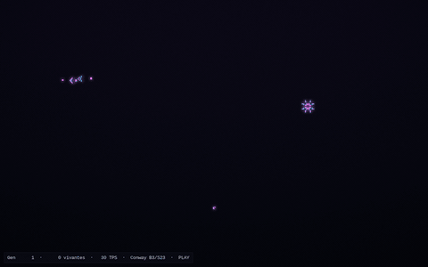

# Game of Life — GPU

A modern, GPU-accelerated implementation of Conway's Game of Life in Python,
built with [ModernGL](https://moderngl.readthedocs.io/) and
[pygame-ce](https://pyga.me/). The entire simulation runs on the GPU as a
fragment shader using a ping-pong of textures, so the grid scales smoothly and
the rendering stays at hundreds of FPS even with the bloom-style post-processing.



*([Also available as MP4](demo.mp4) — 90 KB instead of 3.9 MB.)*

The capture shows a Gosper glider gun (top-left), a pulsar (right) and the
chaotic remains of an R-pentomino (bottom), running live.

## Features

- **GPU simulation** — Conway's rule (or any 2-state outer-totalistic rule)
  evaluated per pixel in a fragment shader, ping-pong between two float textures.
- **Smooth camera** — wheel zoom centered on the cursor and middle-drag pan,
  with an exponential lerp on zoom (interpolated in log-space) for a
  perceptually uniform feel.
- **Pattern library** — 9 classic patterns (Glider, LWSS/MWSS/HWSS, Pulsar,
  Pentadecathlon, Gosper glider gun, R-pentomino, Acorn) with a live preview
  ghost under the cursor and 90° rotation before placement.
- **Switchable rules** — cycle through Conway B3/S23, HighLife B36/S23,
  Day & Night B3678/S34678, Seeds B2/S, Replicator B1357/S1357 and 2x2 B36/S125
  without recompiling the shader (rules are passed as bitmasks).
- **Continuous brush** — paint and erase with the mouse, with line interpolation
  between frames so fast strokes stay solid.
- **Modern look** — cyan→magenta age-based palette, gaussian glow that scales
  with the zoom, age-trail decay, vignette and subtle noise.
- **Snapshot save/load** — export the current grid as a PNG into `snapshots/`
  and reload the latest one with a keystroke.
- **In-game HUD** — generation counter, alive cells, FPS/TPS, current rule
  and a togglable controls cheat-sheet, all rendered on top of the GL frame.

## Requirements

- Python **3.12** (any 3.10+ should work in practice; 3.14 has no wheels for
  ModernGL at the time of writing).
- A GPU with OpenGL 3.3 Core support (anything from the last decade).
- System packages: a working SDL2 runtime and the `libGL.so` / `libEGL.so`
  symlinks. On Fedora / RHEL you may need `mesa-libGL-devel` and
  `mesa-libEGL-devel` if those symlinks are missing.

## Install

```bash
python3 -m pip install --user moderngl pygame-ce numpy
```

If `pip` tries to build pygame from source and complains about `sdl-config`,
make sure `pygame-ce` (the maintained fork) is the one being installed and
that pre-built wheels are available for your Python version:

```bash
python3 -m pip install --user --only-binary=:all: moderngl pygame-ce numpy
```

### Fedora note

If running the program prints `OSError: libGL.so: cannot open shared object file`,
either install the development packages or create user-local symlinks:

```bash
mkdir -p ~/.local/lib
ln -sf /usr/lib64/libGL.so.1  ~/.local/lib/libGL.so
ln -sf /usr/lib64/libEGL.so.1 ~/.local/lib/libEGL.so
export LD_LIBRARY_PATH="$HOME/.local/lib:$LD_LIBRARY_PATH"
```

The included `run.sh` already sets `LD_LIBRARY_PATH` for that case.

## Run

```bash
python3 life.py
# or, on systems that need the symlink workaround above:
./run.sh
```

To regenerate the screenshot at the top of this README:

```bash
python3 life.py --screenshot screenshot.png
```

To regenerate the animated demo, dump N frames and assemble them with ffmpeg:

```bash
python3 life.py --frames frames/ 240 1          # 240 PNGs, 1 sim step per frame
ffmpeg -framerate 30 -i frames/frame_%04d.png \
       -vf "scale=640:-1:flags=lanczos" demo.gif
ffmpeg -framerate 30 -i frames/frame_%04d.png \
       -c:v libx264 -pix_fmt yuv420p -crf 28 demo.mp4
```

The optional third argument (`stride`) runs several simulation steps per captured
frame — use it to speed up long-running scenes without making the GIF huge.

## Controls

| Input | Action |
|---|---|
| **Left mouse** / **Right mouse** | Draw / erase (continuous stroke) |
| **Mouse wheel** | Zoom centered on the cursor |
| **Middle mouse drag** | Pan the view |
| **1** – **9** | Select a pattern (enters placement mode) |
| **Q** / **E** | Rotate the selected pattern 90° CCW / CW |
| **Left click** (in placement mode) | Stamp the pattern under the cursor |
| **Right click** / **Esc** (in placement mode) | Cancel placement |
| **T** | Cycle through rules |
| **Space** | Pause / play |
| **R** | Random fill |
| **C** | Clear the grid |
| **Z** | Reset the camera |
| **+** / **-** | Simulation speed (TPS) |
| **F** | Toggle fullscreen |
| **F5** / **F9** | Save / load snapshot PNG |
| **H** | Toggle the help overlay |
| **Esc** | Quit |

## Patterns

| Key | Pattern |
|---|---|
| 1 | Glider |
| 2 | LWSS — Lightweight spaceship |
| 3 | MWSS — Middleweight spaceship |
| 4 | HWSS — Heavyweight spaceship |
| 5 | Pulsar (period-3 oscillator) |
| 6 | Pentadecathlon (row of 10) |
| 7 | Gosper glider gun |
| 8 | R-pentomino (methuselah) |
| 9 | Acorn (methuselah) |

The world is finite: cells that reach a border die (no toroidal wrap), so
spaceships fly off instead of reappearing on the opposite side. The default
grid is 2048 × 1280 so you have plenty of room to zoom out.

## Rules

Press **T** to cycle. Each rule is encoded as a pair of 9-bit masks
(birth and survive) so adding a new one is a single line in `RULES`.

| Notation | Behavior |
|---|---|
| Conway **B3/S23** | The classic |
| HighLife **B36/S23** | Conway with replicators |
| Day & Night **B3678/S34678** | Symmetric in alive/dead — striking visuals |
| Seeds **B2/S** | Explosive: nothing survives, born with 2 neighbors |
| Replicator **B1357/S1357** | Everything self-replicates |
| 2x2 **B36/S125** | Tends toward 2x2 block patterns |

## Architecture

`life.py` is a single file. The simulation is entirely on the GPU:

- Two RGBA32F textures act as a ping-pong pair. Channel **R** holds the live
  state (0 or 1), channel **G** holds a normalized "age" that decays after a
  cell dies — used by the display shader to produce the trailing glow.
- `SIM_SHADER` evaluates the rule per pixel and writes the next state to the
  back texture. Rule birth/survive masks are uniforms.
- `PAINT_SHADER` writes a circular brush into the state texture. Patterns
  use a CPU-side `stamp()` that does a read-modify-write through numpy.
- `DISPLAY_SHADER` samples the front state with a view transform
  (`uv = (v_uv - 0.5) * zoom + center`), applies a 7×7 gaussian glow on the
  age channel, the cyan→magenta palette, the vignette and a tiny dithering term.
- `PREVIEW_SHADER` overlays a translucent yellow ghost of the selected pattern,
  pulsed with `sin(time)`.
- `HUD_SHADER` blits CPU-rendered text panels (pygame `font.render` →
  RGBA bytes → temporary GL texture) on top of the frame.

The view has a **target** state and a **current** state; each frame the current
exponentially decays toward the target (`1 - exp(-dt * speed)`), with the zoom
interpolated in log space so a 1×→2× transition takes the same perceived time
as 2×→4×. Panning bypasses the lerp to avoid drag elasticity.

## Project layout

```
.
├── life.py        # everything: shaders, simulation, rendering, input
├── run.sh         # convenience launcher (sets LD_LIBRARY_PATH on Fedora)
├── snapshots/     # PNGs saved with F5
└── README.md
```

## Tweaking

A few constants at the top of `life.py` are worth playing with:

| Constant | Default | Effect |
|---|---|---|
| `GRID_W`, `GRID_H` | 2048 × 1280 | Simulation resolution. Drop to 1024×640 on weaker integrated GPUs. |
| `INITIAL_TPS` | 30 | Starting simulation rate (ticks per second). |
| `LERP_SPEED` | 18 | Camera responsiveness. Higher = snappier, lower = lazier. |
| `ZOOM_MIN`, `ZOOM_MAX` | 0.02, 4.0 | How far in / out you can zoom. |

## Changelog

### v0.2.0 — Bigger finite world (2026-04-19)

- Default grid bumped from 512×320 to **2048×1280** — zoom out now reveals
  empty space around the world instead of a tiled repeat of the grid.
- Simulation is no longer toroidal: out-of-grid neighbors count as dead, so
  spaceships leaving through a border disappear instead of wrapping to the
  opposite side.
- Rendering shaders (`DISPLAY`, `GLOW_H`) mask out samples beyond the grid,
  and a slightly darker background is drawn outside to make the boundary visible.
- `STAMP_SHADER` no longer wraps either: patterns stamped near a border are clipped.
- Pattern placement click no longer triggers a paint stroke when the left
  button stays held down right after the stamp.
- `run.sh` discovers `python3` from `PATH` (or `$PYTHON`) instead of a
  hardcoded pyenv install path, and only prepends `~/.local/lib` to
  `LD_LIBRARY_PATH` when that directory actually exists.

### GPU perf pass

Benchmarked on a 512×320 grid at 1280×800 (averaged over 3000 iterations):

| Measurement | Before | After | Speedup |
|---|---|---|---|
| Sim step | 332 µs | 176 µs | **1.9×** |
| Render frame | 5576 µs | 1994 µs | **2.8×** |
| Alive count | 1237 µs | 1035 µs | 1.2× |

- **State texture RGBA32F → RG8** — we only use `.r` (alive) and `.g`
  (age), so 2 bytes/cell instead of 16. `SIM_SHADER` is memory-bound
  (9 neighbor fetches per pixel), so the 8× bandwidth cut translates
  almost linearly to simulation time.
- **Separable Gaussian glow** — replaces the 7×7 kernel (49 taps/pixel)
  with two 1D passes: H at screen resolution into an intermediate R8
  texture, then V fused into the display shader. 14 taps/pixel instead
  of 49.
- **Alive count via mipmap** — instead of a `glReadPixels` of the whole
  grid (2.5 MB in RGBA32F), we copy `.r` into an R32F, generate the
  mipmap chain and read the 1×1 top level (4 bytes).
- **Cached HUD textures** — the previous code allocated then released a
  `ctx.texture` per panel per frame. A label-keyed cache holds the
  texture and rewrites its contents; a new allocation is only needed
  when the size changes.
- **Pattern stamps fully on GPU** — no more numpy read/write round-trip.
  The pattern is uploaded into a texture and a `STAMP_SHADER` combines
  state + pattern with toroidal wrap (`fract(d + 0.5) - 0.5`).

A `--bench N` mode reproduces the measurements:

```bash
python3 life.py --bench 3000
```
